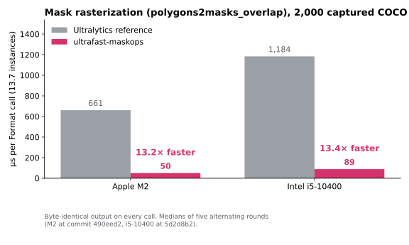
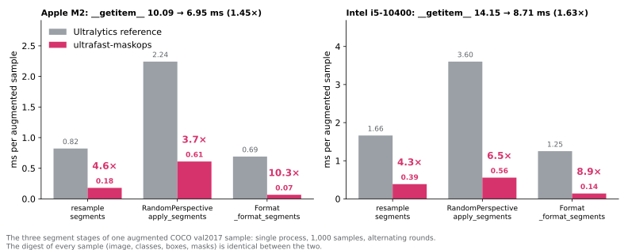
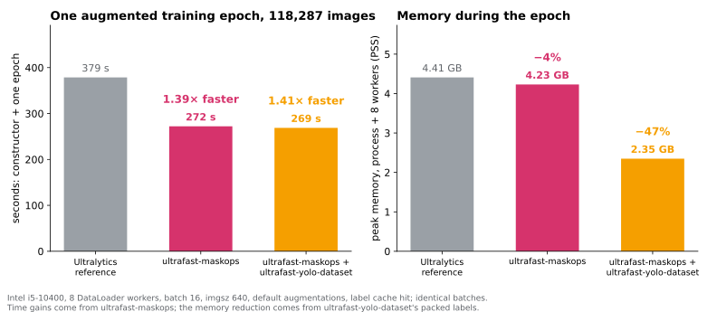

# ultrafast-maskops

[](https://github.com/developer0hye/ultrafast-maskops/actions/workflows/wheels.yml)

Exact native replacements for the slow parts of the Ultralytics segmentation
data pipeline: mask rasterization and segment geometry. Every accelerated
function returns the **same bytes** as the pinned Ultralytics code, and the
batches a trainer receives are identical, so the training run does not change.

**13–20× faster mask rasterization · 2.5–10× faster segment geometry · 1.4×
faster augmented epochs**, measured on real COCO data against the unmodified
pipeline on three hosts (Apple M2, Intel i5-10400 on Linux, Intel i5-12600 on
Windows).

The extension depends on nothing but pybind11 and NumPy. It bundles no OpenCV:
the kernel replicates `cv2.fillPoly` and the 4× linear downscale in integer
arithmetic, evaluated only where the downscale reads, and is verified against
the cv2 you have installed the first time each image size is used.

**Status:** alpha. Validated against Ultralytics commit
`795a556942a12fe0124cf767888194a1d0b83e2e` (8.4.149); the adapter checks the
source hashes of the functions it replaces and refuses others.

## Installation

Prebuilt wheels for CPython 3.10–3.13 on Linux x86-64/aarch64, macOS and
Windows are built by the [release workflow](docs/publishing.md); until the
first PyPI release, install from source:

```bash
python -m pip install git+https://github.com/developer0hye/ultrafast-maskops.git
```

Requirements: Python 3.10+, a C++20 compiler and CMake 3.20+. Nothing is
downloaded during the build; the extension is one translation unit and about
0.3 MB.

## Quick start

Train with the Ultralytics `SegmentationTrainer` whose datasets are accelerated
after construction. Nothing global is patched.

```python
from ultralytics import YOLO
from ultrafast_maskops.training import FastSegmentationTrainer

YOLO("yolo11n-seg.pt").train(data="coco.yaml", trainer=FastSegmentationTrainer)
```

The same two calls work on any segmentation `YOLODataset` you build yourself,
for example inside a custom trainer's `build_dataset`:

```python
from ultrafast_maskops.ultralytics import accelerate_dataset
from ultrafast_maskops.geometry import accelerate_geometry

accelerate_dataset(dataset, persistent=True)   # mask rasterization
accelerate_geometry(dataset, persistent=True)  # resampling, affine boxes and clipping
```

`persistent=True` keeps the acceleration when Ultralytics rebuilds the
transforms for `close_mosaic`. The standalone wrappers `polygon2mask`,
`polygons2masks` and `polygons2masks_overlap` keep the reference signatures.

## Mask rasterization: 13–20× faster, byte for byte

`polygons2masks_overlap` is the reference's costliest per-instance step: it
fills every instance into a full-resolution image, downsamples it and sums it.
The native kernel computes the same 160×160 bytes from the two rows and two
columns of every 4×4 block that the downscale actually reads.



| Host | Reference | ultrafast-maskops | Speedup |
|---|---:|---:|---:|
| Apple M2 (macOS, Clang) | 661 µs | **50 µs** | **13.2×** |
| Intel i5-10400 (Linux, GCC) | 1,184 µs | **89 µs** | **13.4×** |
| Intel i5-12600 (Windows 11, MSVC) | 1,200 µs | **60 µs** | **20.1×** |

2,000 captured COCO `Format` calls (27,497 instances). The kernel retires
0.72 M instructions per call against the reference's 9.8 M. On Windows the
reference's per-instance cv2 and NumPy calls cost more than on Linux while the
kernel does not, so the same code gains more there.

## Segment geometry: 2.5–10× faster per stage, 1.45–1.63× per sample

Three stages of an augmented sample are per-instance Python loops over small
NumPy and OpenCV calls. Each is replaced by one native batch that follows the
reference operation by operation, in the input precision.



| Stage | M2 reference → ours | i5-10400 (Linux) reference → ours | i5-12600 (Windows) reference → ours |
|---|---:|---:|---:|
| `resample_segments` | 0.82 → 0.18 ms (4.6×) | 1.66 → 0.39 ms (4.3×) | 1.09 → 0.43 ms (2.5×) |
| `RandomPerspective.apply_segments` | 2.24 → 0.61 ms (3.7×) | 3.60 → 0.56 ms (6.5×) | 3.21 → 0.57 ms (5.7×) |
| `Format._format_segments` | 0.69 → 0.07 ms (10.3×) | 1.25 → 0.14 ms (8.9×) | 1.32 → 0.13 ms (9.9×) |
| whole `__getitem__` | 10.09 → 6.95 ms (**1.45×**) | 14.15 → 8.71 ms (**1.63×**) | 14.25 → 9.84 ms (**1.45×**) |

The rest of a sample is JPEG decoding, `warpAffine` and HSV conversion, which
already run in OpenCV; removing the segment stages entirely would bound the
sample at 1.6–1.85×.

## One training epoch at COCO scale: 1.4× faster

118,287 COCO-distributed images, the Ultralytics train-mode dataset and
DataLoader (8 workers, batch 16, imgsz 640, every default augmentation), one
fresh process per measurement.



| Pipeline | Constructor + epoch | Throughput | Peak memory (PSS) |
|---|---:|---:|---:|
| Ultralytics reference | 379 s | 316 img/s | 4.41 GB |
| ultrafast-maskops | **272 s (1.39×)** | 441 img/s | 4.23 GB |
| + [ultrafast-yolo-dataset](https://github.com/developer0hye/ultrafast-yolo-dataset) | 269 s (1.41×) | 441 img/s | **2.35 GB (−47%)** |

Before timing, every batch of a whole epoch (7,393 batches) was digested for
all three pipelines: the digests are identical.
[Method, per-stage anatomy and raw reports](docs/SEGMENT_GEOMETRY.md).

## Exactness

- The mask kernel follows OpenCV 4.13's `clipLine`, `LineIterator`,
  `CollectPolyEdges` and `FillEdgeCollection` in 16.16 fixed point, evaluated
  only on sampled rows and columns; the 4× resize is a calibrated 16-entry
  table of the four sampled pixels.
- The geometry kernels are compiled with `-ffp-contract=off` and replicate each
  NumPy ufunc separately; `np.interp`'s fused multiply-add is calibrated against
  the installed NumPy, and the affine matrix product stays in NumPy because no
  calibration can guarantee a BLAS's summation order for every shape.
- Batches with NaN, infinity or negative zero, other ratios or sizes, colors
  other than 1, several contours in one mask, coordinates outside the exact
  envelope, and any image size whose cv2 results the calibration cannot
  reproduce run the unmodified reference code. `backend_info()` lists the
  sizes handled natively and the sizes handed back.
- Verification: parity suites in SIMD and scalar modes on Linux, macOS and
  Windows (`ULTRAFAST_MASKOPS_SCALAR=1` selects the scalar twin of every vector
  path); differential fuzzing of the kernel against `cv2.fillPoly` over about
  500,000 random contours and 8 G output pixels without a difference; a whole
  COCO-scale epoch with identical batch digests; and a two-epoch training run
  across `close_mosaic` in which every batch the trainer received was identical
  ([tests/test_trainer.py](tests/test_trainer.py)).

## Compatibility and limitations

- Ultralytics is pinned to the validated commit through source hashes. Other
  versions raise a `RuntimeError` naming the changed function rather than
  silently running.
- Requires NumPy 2. cv2 is whatever Ultralytics installed; it is not pinned.
- `mask_ratio=4` (the default) with image sides divisible by 4 is the native
  profile; everything else is correct but not accelerated.
- Custom `Format` subclasses and custom `build_transforms` overrides are not
  replaced; the helpers raise instead of guessing.

## Development and verification

```sh
uv venv --python 3.12
uv pip install --python .venv/bin/python -e ".[test]"
.venv/bin/python -m pytest -q tests/test_parity.py tests/test_sampled.py
```

The integration suite additionally needs `.[ultralytics]` at the pinned
Ultralytics commit (see `requirements-integration.txt`):

```sh
.venv/bin/python -m pytest -q tests
```

Benchmarks are reproduced with `bench/mask_stage.py`,
`bench/geometry_loader.py` and `bench/coco_epoch.py`; the README charts are
rendered from the recorded reports by `bench/plot_readme.py`. Raw reports live
in [bench/results](bench/results/README.md), earlier development records in
[docs/archive](docs/archive).

## License

[AGPL-3.0-only](LICENSE): the replaced functions derive from Ultralytics, which
is AGPL-3.0. The only compiled third-party component is pybind11
([licenses](licenses)).
