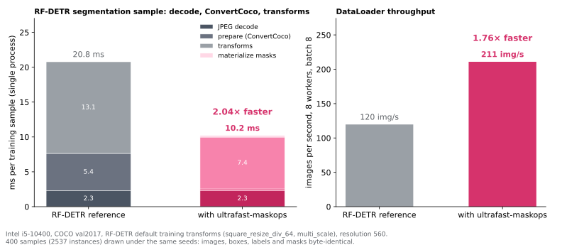

# RF-DETR: deferred mask rasterization

RF-DETR's segmentation datasets (`rfdetr.datasets.coco.CocoDetection` with
`include_masks=True`) spend most of a training sample's CPU time on masks.
`ConvertCoco` rasterizes every polygon at full resolution with pycocotools,
then every `Resize`, `RandomSizedCrop` and `RandomHorizontalFlip` resamples the
whole `(N, H, W)` mask tensor. The adapter in `ultrafast_maskops.rfdetr` keeps
the polygons instead, records what the random transforms did, and rasterizes
once, only at the output pixels. The result is the same bytes RF-DETR produces.

## Profile of the unmodified pipeline

Intel i5-10400, RF-DETR develop `2398ce3c` (1.11.0.dev0), torch 2.10 CPU,
COCO val2017, default training transforms (`make_coco_transforms_square_div_64`,
multi-scale, resolution 560), single process, 400 samples (6.3 instances each):

| Stage | Time per sample | Share | Mask-related part |
|---|---:|---:|---|
| JPEG decode (PIL) | 2.4 ms | 11% | — |
| `ConvertCoco` (prepare) | 5.3 ms | 25% | `convert_coco_poly_to_mask`: pycocotools `frPyObjects` + `decode` at full resolution, `any` over polygons, `[keep]`, `.bool()` |
| transforms | 13.3 ms | 63% | nearest resize of the mask tensor (once or twice), crop, flip: about 5.9 ms; the rest is the PIL image resize, `ToImage`/`ToDtype`/`Normalize` |
| **total** | **21.0 ms** | | about 11 ms of mask work |

## What the adapter does

`accelerate_dataset(dataset)` replaces two attributes of the dataset in place:

- `dataset.prepare` becomes `FastConvertCoco`. It runs RF-DETR's own
  `ConvertCoco` with `include_masks=False` for boxes, labels, areas, keypoints
  and sizes, recomputes the instance filter the way `ConvertCoco` does, and
  stores the kept instances' polygons as float64 arrays under
  `target["maskops_polygons"]` together with an empty `Trace`. Samples whose
  segmentations pycocotools would not read as polygons (RLE dicts, a four-number
  first entry, missing `segmentation` on the first annotation) go through the
  original `ConvertCoco` unchanged.
- `dataset._transforms` becomes a copy of the transform tree whose geometric
  leaves are traced subclasses: `TracedResize`, `TracedRandomResize`,
  `TracedRandomSizedCrop` and `TracedRandomHorizontalFlip` call the RF-DETR
  implementation (same random draws, same image, boxes and keypoints) and
  append `("resize", old, new)`, `("crop", top, left, h, w)` or `("hflip",)` to
  the trace. `ToImage`, `ToDtype` and `Normalize` pass through; any other
  transform type raises, since its effect on masks would be unknown.
  `MaterializeMasks` is appended last: it composes the trace into two index maps
  (output row → source row, output column → source column, −1 where a crop
  padded) and calls the native kernel.

`_filter_per_instance_fields` in RF-DETR's `crop` filters every list whose
length equals the number of boxes, so the polygon list follows the boxes
through crops for free; the `Trace` is not a sequence and is left alone.
torchvision's tree transforms (`ToImage`, `ToDtype`) only touch tensors, PIL
images and NumPy arrays, so `Polygons` leaves survive them.

## The kernel

`src/rfdetr.hpp` replicates pycocotools' `rleFrPoly` followed by `decode`:

1. Vertices are scaled by 5 and rounded as the C code does (`(int)(5x + .5)`,
   with the x86-64 conversion of NaN or out-of-range values to `INT_MIN`).
2. Every edge is walked as a dense integer line with the same double
   arithmetic (`(int)(ys + s*t + .5)`; the extension is compiled with
   `-ffp-contract=off`, matching pycocotools' x86-64 build, which has no FMA).
   The walk skips what cannot toggle: along an x-major edge the column
   advances by one per step and only columns `5n + 2` (after the C code's
   `u - 1` adjustment) can toggle, so only every fifth step and its
   predecessor are evaluated; along a steep edge (`dy >= 4 dx`) the column is
   a monotone function of the step (a correctly rounded product and sum of a
   fixed slope, then a monotone truncation), so the next column change is
   found by galloping and bisection. Every pair that can toggle is still
   evaluated with the C formula at its own step.
3. Consecutive points that change column produce a toggle at column `x` and
   row `y ∈ [0, h]`, exactly the "y-boundary points" of `rleFrPoly`. The
   C code's tests on `((u + .5) / 5 - .5)` are integer tests here: both
   doubles are exact rationals with fractional parts in fifths, so `xd` is
   integral exactly when the adjusted column is `5n + 2`, and the `ceil` of
   the row is a floor division.
4. `decode` alternates 0/1 between the sorted column-major positions
   `x*h + y`, so pixel `(y, x)` is set when an odd number of toggles lie at or
   before that position. The kernel keeps one bit per source column, initialized
   to the parity of the toggles in earlier columns (a column with an odd number
   of toggles leaks into every later column, and a toggle at `y == h` counts
   for later columns only, both as in pycocotools), buckets the toggles by row,
   sweeps the sampled source rows once flipping bits as toggles pass, skips rows
   with no set bit, and paints each 1-run through the column map with `memset`.
   Output rows that read the same source row copy the painted span. Only ones
   are written, so several polygons of one instance union in the same zeroed
   plane, as `mask.any(dim=2)` does in RF-DETR.

The torch `nearest` index rule is `min(floor(float32(i) * (float32(in) /
float32(out))), in - 1)`; it was checked against
`torch.nn.functional.interpolate` on 5,993 size pairs with no mismatch.

On seven COCO-like instances (690 vertices, 2.2 MB of output) the kernel takes
about 150 µs on the M2, of which 19 µs allocate and zero the output; the
first version took 299 µs, most of it in a double division per dense step and
a `std::sort` of the toggles.

## Results

Same host and configuration as the profile ([raw report](../bench/results/rfdetr-loader-linux-v2.json); [v1](../bench/results/rfdetr-loader-linux-v1.json) is the first kernel, with materialize at 0.34 ms):

| | RF-DETR reference | with ultrafast-maskops | Speedup |
|---|---:|---:|---:|
| `__getitem__`, single process | 20.78 ms | **10.20 ms** | **2.04×** |
| of which prepare / transforms / materialize | 5.36 / 13.14 / — | 0.26 / 7.43 / 0.23 | |
| DataLoader, 8 workers, batch 8 | 119.7 img/s | **210.9 img/s** | **1.76×** |

The remaining 10.2 ms are JPEG decoding, the PIL image resize and
normalization; the mask work went from about 11 ms to 0.5 ms. Whether a
training run speeds up depends on whether its GPU was waiting on the loader.

## Verification

- `tests/test_rfdetr.py`: the kernel against pycocotools + torchvision on
  random polygons (star-shaped, self-intersecting, partly outside, integer and
  half-integer vertices, repeated points, degenerate) through random
  resize/crop/flip chains, the identity chain against the full raster, and
  padded or flipped index maps. With RF-DETR installed, a synthetic COCO dataset
  (polygons, RLE, crowd and degenerate boxes) is drawn through an unmodified
  `CocoDetection` and through an accelerated one under the same seeds, for the
  square and the non-square training pipelines: images, boxes, labels, areas,
  sizes and masks are `torch.equal`.
- `bench/verify_rfdetr.py`: the whole val2017 split (5,000 images, 65,177
  instances) under two seeds each, 0 mismatches, and 2,000 further
  random-polygon fuzz cases on canvases up to 400 px (445 M output pixels)
  without a difference ([report](../bench/results/rfdetr-verify-linux-v1.json)).
- `bench/rfdetr_loader.py` checks 400 samples for identical digests before
  timing anything.

## Where to call it in RF-DETR training

`RFDETRDataModule.setup("fit")` builds the training dataset with
`build_dataset("train", ...)` and keeps it as `_dataset_train`; the
DataLoader is created later by `train_dataloader()`. A subclass that calls
`accelerate_dataset(self._dataset_train)` after `super().setup(stage)` (when
`_dataset_train.prepare.include_masks` is set) accelerates every worker,
because the traced transforms and `FastConvertCoco` pickle like RF-DETR's own.
`RFDETR.train()` constructs the data module internally and offers no hook for
a subclass yet, so this currently applies to Lightning runs that build the data
module themselves.

## Compatibility

- RF-DETR develop `2398ce3c` (1.11.0.dev0). `check_profile()` hashes the
  sources of `ConvertCoco`, `convert_coco_poly_to_mask`,
  `CocoDetection.__getitem__`, the four geometric transforms, `crop`,
  `_filter_per_instance_fields`, `_apply_to_masks` and the three combinators,
  and refuses anything else with a `RuntimeError` naming the function.
- The torchvision default backend only. Albumentations (`aug_config`) and the
  YOLO-format dataset (`rfdetr.datasets.yolo`, PIL `ImageDraw` masks) are not
  accelerated; `trace_transforms` raises on transform types it does not know.
- `gpu_postprocess=True` (kornia) is compatible: masks are materialized at the
  end of the CPU pipeline, before collation.
- Exactness is defined against pycocotools as built for x86-64 Linux, i.e.
  the C source's unfused double arithmetic. The arm64 macOS wheel of
  pycocotools 2.0.11 contracts `ys + s*t + .5` into a fused multiply-add and
  differs from that by one pixel in one of 4,000 fuzz seeds on an Apple M2; an
  unfused pure-Python port of `rleFrPoly` agrees with the kernel on that case.
  Training on x86-64 Linux sees no difference (4,000 seeds, 5,000 val2017
  images × 2 seeds).
